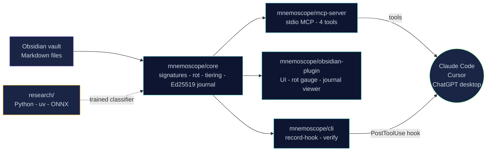

<div align="center">


<p>
  <a href="https://github.com/toonight/Mnemoscope/blob/main/LICENSE"></a>
  <a href="https://nodejs.org"></a>
  <a href="https://modelcontextprotocol.io"></a>
  
  
  
  <a href="https://github.com/toonight/Mnemoscope/actions/workflows/ci.yml"></a>
</p>

<p><i>An open-source observability layer for LLM agent memory on Markdown vaults.<br/>Predict context rot before it happens. Audit what your agent reads and writes. Tier your knowledge the way the science says you should.</i></p>

</div>

---

> [!NOTE]
> The dominant 2025–2026 narrative on X — *"Markdown trips up the LLM at scale"* — is partially wrong. **Markdown** does not trip up the LLM. **Long-context loading** trips up the LLM ([Chroma, *Context Rot*, July 2025](https://www.trychroma.com/research/context-rot)). Mnemoscope is built on that distinction.

## ✨ Why Mnemoscope?

Mnemoscope is **not** another memory store. It is an **instrument** to:

- 🎯 **Predict** the rot risk of a corpus *before* it gets injected into the LLM.
- 📝 **Witness** what the agent reads and writes during a session, with a locally signed audit trail.
- 🧱 **Tier** the corpus into a working / episodic / semantic hierarchy, drawing on the science instead of the GraphRAG hype.

It ships as an **MCP server** (consumable by Claude Code, Cursor, ChatGPT desktop, and any MCP-compatible client) plus an **Obsidian plugin** for the visual side. Everything runs **100% locally**. No cloud. No telemetry without explicit opt-in.

## 🧭 The three contribution axes at a glance

| | Axis | What it does | Status |
|:-:|---|---|:-:|
| 🎯 | **Predictive context-rot scoring** | Computes a `rot_risk` score (0–100) from structural signatures *before* injection, broken down across 5 documented factors (token volume, semantic redundancy, distractor density, structural coherence, freshness spread), each citation-backed. | 🟢 v0 heuristic shipping; calibrated classifier next |
| 📝 | **Signed local journal** | Append-only JSONL log of every agent read/write/create/delete on the vault. Each entry is signed with a per-vault **Ed25519** keypair; `mnemoscope-verify` flags any tampered or foreign-signed entry. | 🟢 working signing & tamper detection |
| 🧱 | **Hierarchical memory tiering** | Reference implementation of the working/episodic/semantic split that 2025–2026 agent-memory research keeps converging on, on plain Markdown. v0 split is freshness-based; access frequency and pinning will follow. | 🟢 v0 shipping |

> [!TIP]
> Each axis has a separate research thread in [`research/`](./research) — open-source classifier training, MarkdownMemBench dataset construction, and a Chroma replication. Researchers are explicitly invited.

## 🚀 Quickstart

```bash
git clone https://github.com/toonight/Mnemoscope
cd Mnemoscope
npm install
npm run build
npm test          # 24 tests, ~6s
```

### Use it from Claude Code (or any MCP client)

Add Mnemoscope to your MCP client config:

```json
{
  "mcpServers": {
    "mnemoscope": {
      "command": "node",
      "args": ["/absolute/path/to/Mnemoscope/packages/mcp-server/dist/index.js"]
    }
  }
}
```

Then call any of the four tools:

| Tool | What it does |
|---|---|
| `predict_rot` | Returns the rot risk score (0–100), factor breakdown, and 5 highest-risk notes for a vault. |
| `get_tiered_read` | Splits a vault into `working` / `episodic` / `semantic` layers, so the agent can read a compacted view instead of the full dump. |
| `record_journal` | Appends a forensic entry (read/write/create/delete + content hash + Ed25519 signature) to the local journal. |
| `read_journal` | Replays journal entries, optionally filtered by `session_id`. |

### Auto-journal every Claude Code Write/Edit/MultiEdit

Instead of asking the agent to call `record_journal` on every write — which it will forget — wire the bundled hook into Claude Code:

```json
// ~/.claude/settings.json
{
  "hooks": {
    "PostToolUse": [
      {
        "matcher": "Write|Edit|MultiEdit",
        "hooks": [{ "type": "command", "command": "mnemoscope-record-hook" }]
      }
    ]
  }
}
```

Full setup: [docs/claude-code-hook.md](./docs/claude-code-hook.md). The hook never blocks the tool call: any internal error is logged to stderr and the process exits 0.

### Verify the journal at any time

```bash
mnemoscope-verify /path/to/vault
# ok    2026-04-26T19:42:13.001Z  write  /vault/notes/foo.md
# ok    2026-04-26T19:43:01.220Z  write  /vault/notes/bar.md
# 2 entries; 2 valid; 0 invalid
```

## 🏗️ Architecture



```
mnemoscope/
├── packages/
│   ├── core/              # rot scoring, tiering, Ed25519-signed journal, signatures
│   ├── mcp-server/        # MCP server (stdio); 4 tools, integration-tested via spawn
│   ├── obsidian-plugin/   # Obsidian plugin: rot gauge command
│   └── cli/               # mnemoscope-record-hook, mnemoscope-verify
├── research/              # Python: predictive classifier, MarkdownMemBench, Chroma replication (planned)
└── docs/                  # banner, logo, claude-code-hook setup
```

## 🤝 Voisins (not competitors)

Mnemoscope is a citizen of an existing ecosystem, not a replacement for any of it.

| Project | What it does | Where Mnemoscope sits |
|---|---|---|
| [Anthropic Memory tool](https://platform.claude.com/docs/en/agents-and-tools/tool-use/memory-tool) | Official, file-based, primitive | Adds rot-scoring + journal Anthropic doesn't provide |
| [Letta](https://letta.com) / [MemGPT](https://github.com/letta-ai/letta) | Runtime-stateful agents | Different layer — we sit *under* the agent |
| [Mem0](https://mem0.ai), [Zep](https://getzep.com), [Cognee](https://cognee.ai) | Generic memory stores | Different scope — we are MD-vault-native |
| [MemPalace](https://mempalace.tech) | Viral OSS memory MCP | Not Obsidian-specific; complementary |
| [Smart Connections](https://smartconnections.app) | RAG-vector for Obsidian | Co-installable; we are runtime/forensics, they are search |
| [Basic Memory MCP](https://github.com/basicmachines-co/basic-memory) | Semantic graph over markdown | Closest in spirit — we want to interop, not duplicate |
| [claude-memory-compiler](https://github.com/coleam00/claude-memory-compiler) | MD-compiler approach | Reach out before duplicating |

> [!IMPORTANT]
> If you maintain one of these projects and see overlap or complementarity, please [open an issue](https://github.com/toonight/Mnemoscope/issues/new) — collaboration is the explicit design goal.

## 🔬 Scientific posture

Mnemoscope is meant to be a tool **and** a contribution to the public empirical record on agent memory.

| Research thread | Why it matters |
|---|---|
| **MarkdownMemBench** *(planned)* | Today's benchmarks ([LongMemEval](https://arxiv.org/pdf/2410.10813), [LoCoMo](https://snap-research.github.io/locomo/)) are conversational and English-only. There is no public bench for vault-native, MD-native agent memory. |
| **Predictive Context Rot classifier** *(planned)* | Every existing benchmark measures degradation *after* injection. We aim to predict it *before*, calibrated against LongMemEval/LoCoMo with R² ≥ 0.6. |
| **Replication of Chroma's *"structured > shuffled is worse"*** *(planned)* | Chroma showed coherent haystacks underperform shuffled ones on NIAH. Nobody has replicated or refuted this on real Obsidian vaults yet. |

Each thread will live in [`research/`](./research) and produce a preprint alongside the code.

## ✅ What works today (v0.0.1)

| | What | How verified |
|---|---|---|
| ✅ | Monorepo scaffold, Apache-2.0, npm workspaces, Node 22+, zero runtime deps in `core` | `npm run build` green |
| ✅ | `predict_rot` returns a 5-factor breakdown, citation-backed in source | 12 unit tests in `rot-score.test.ts` |
| ✅ | Smoke-tested on a real 506K-token Obsidian vault (rot risk 41/100, top-risk notes are the largest ones — sensible) | manual run, transcript in commit history |
| ✅ | `get_tiered_read` splits a vault into working/episodic/semantic by freshness | integration test on fixture vault |
| ✅ | `record_journal` produces a real **Ed25519** signature; `verifyAll` detects any field tampering and any foreign-key entry | 5 unit tests including 4 tamper-detection tests |
| ✅ | MCP server passes 5 end-to-end integration tests over real JSON-RPC stdio | `node --test packages/mcp-server/dist/**/*.test.js` |
| ✅ | `mnemoscope-record-hook` is a Claude Code `PostToolUse` hook that auto-journals every Write/Edit/MultiEdit | `docs/claude-code-hook.md` |
| ✅ | `mnemoscope-verify` CLI replays the journal and exits non-zero on any invalid entry | wired to the same `verifyAll` |
| ✅ | Obsidian plugin compiles to a single 8 KB bundle | esbuild config in `packages/obsidian-plugin` |
| ✅ | CI green on Node 22, **0 npm vulnerabilities** | GitHub Actions on every push |

## 🛣️ Roadmap (next)

> [!NOTE]
> The list below is what *isn't* done yet. Each item is sized so a single contributor can claim it. Open an issue before starting.

- [ ] Dogfood the auto-journal hook on the author's vault for two full weeks; tune the rot heuristic against observed Claude Code session outcomes
- [ ] Submit the MCP server to Smithery / PulseMCP / Glama registries
- [ ] Submit the Obsidian plugin to the community plugins registry
- [ ] Chained signatures: each entry signs the hash of the previous one, so journal truncation becomes detectable
- [ ] Replace the v0 heuristic rot score with a calibrated ONNX classifier trained on LongMemEval / LoCoMo / MarkdownMemBench
- [ ] Release **MarkdownMemBench v0.1** — the first MD-native, vault-native bench for agent memory
- [ ] Preprint #1: replication of Chroma *Context Rot* on real Obsidian vaults

## 🧑‍🤝‍🧑 Contributing

PRs are welcome but the most useful first step is opening an issue describing what you want to do. See [CONTRIBUTING.md](./CONTRIBUTING.md).

If you are a **researcher** at Letta, Chroma, Mem0, Cognee, OSU-NLP, Snap Research, or any related lab, and you see overlap with the *Predictive Context Rot* or *MarkdownMemBench* axes, please reach out — the project is explicitly designed for this.

## 📜 License

[Apache License 2.0](./LICENSE). Apache-2.0 was chosen over MIT for its explicit patent grant, which we believe is appropriate for a project introducing novel scoring methods in an active research area.

## 🙏 Acknowledgements

Mnemoscope's framing borrows directly from public work by:

- [Chroma Research — *Context Rot* (July 2025)](https://www.trychroma.com/research/context-rot)
- [Letta — *Is a Filesystem All You Need?* (August 2025)](https://www.letta.com/blog/benchmarking-ai-agent-memory)
- [Letta — *Sleep-time Compute* (2025)](https://www.letta.com/blog/sleep-time-compute)
- [Microsoft — *LazyGraphRAG* (June 2025)](https://www.microsoft.com/en-us/research/blog/lazygraphrag-setting-a-new-standard-for-quality-and-cost/)
- [HippoRAG (NeurIPS'24, OSU-NLP)](https://github.com/osu-nlp-group/hipporag)
- [LongMemEval (ICLR 2025)](https://arxiv.org/pdf/2410.10813)
- [LoCoMo (Snap Research)](https://snap-research.github.io/locomo/)
- [Andrej Karpathy's LLM Wiki proposal (April 2026)](https://gist.github.com/rohitg00/2067ab416f7bbe447c1977edaaa681e2)

Without their public artifacts, this project would not be possible.

<div align="center">
<sub>🧠  <code>predict · witness · tier</code>  🧠</sub>
</div>
