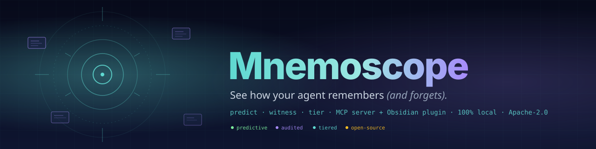
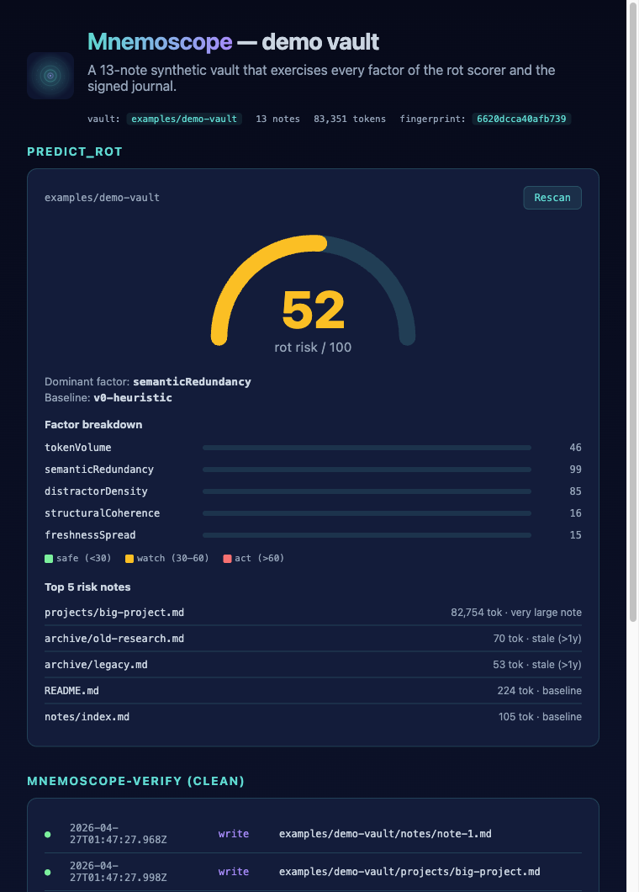
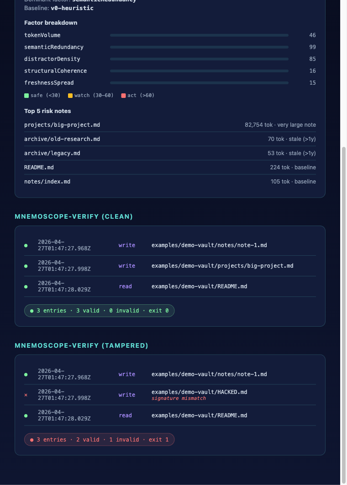
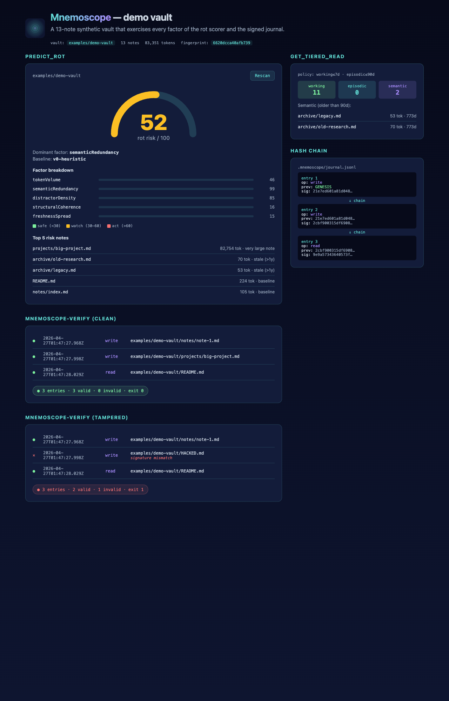
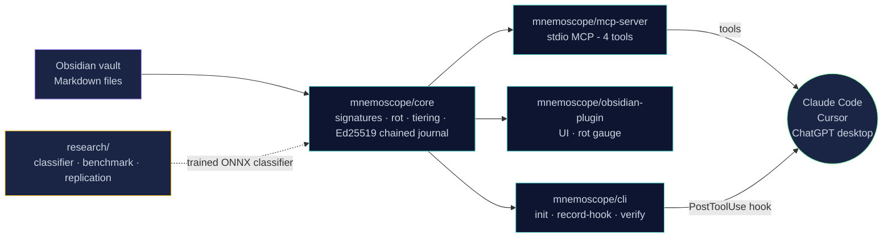
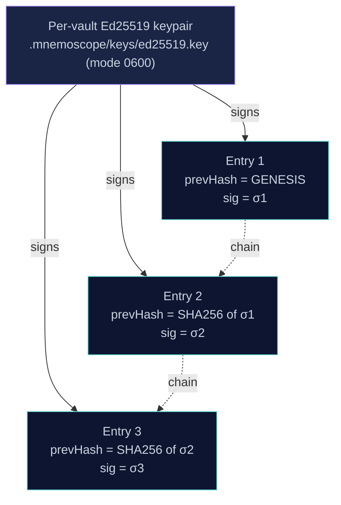

<div align="center">



<p>
  <a href="https://github.com/toonight/Mnemoscope/blob/main/LICENSE"></a>
  <a href="https://nodejs.org"></a>
  <a href="https://modelcontextprotocol.io"></a>
  
  
  
  
  <a href="https://github.com/toonight/Mnemoscope/actions/workflows/ci.yml"></a>
</p>

<p><b>An open-source observability layer for LLM agent memory on Markdown vaults.</b><br/>
<i>Predict context rot before it happens · audit every agent write with a signed journal · tier your knowledge the way the science says you should.</i></p>

<sub><a href="#-see-it-in-action">Demo</a> · <a href="#-how-it-fits-your-workflow">Workflow</a> · <a href="#-the-four-mcp-tools">Tools</a> · <a href="#-quickstart">Quickstart</a> · <a href="#%EF%B8%8F-architecture">Architecture</a> · <a href="#-scientific-posture">Science</a></sub>

</div>

---

> [!NOTE]
> The dominant 2025–2026 narrative on X — *"Markdown trips up the LLM at scale"* — is partially wrong. **Markdown** does not trip up the LLM. **Long-context loading** trips up the LLM ([Chroma, *Context Rot*, July 2025](https://www.trychroma.com/research/context-rot)). Mnemoscope is built on that distinction.

## 👀 See it in action

Real output, captured from the bundled [`examples/demo-vault`](./examples/demo-vault) — a 13-note synthetic vault built so every rot factor moves. Reproduce locally with `mnemoscope-init examples/demo-vault` (full transcript: [SAMPLE-OUTPUT.md](./examples/demo-vault/SAMPLE-OUTPUT.md)).

<table>
<tr>
<td width="50%" valign="top">

**`predict_rot` — score, factors, top-risk notes**



</td>
<td width="50%" valign="top">

**`mnemoscope-verify` — clean run vs. tamper detection**



</td>
</tr>
</table>

<details>
<summary>Full overview (click) — gauge, factors, top-risk notes, both verify states, tier counts, hash chain — all on one page</summary>



</details>

## ✨ What is Mnemoscope?

Mnemoscope is **not** another memory store. It is an **instrument** that sits between your LLM agent and your Markdown vault and gives you three things nobody else gives you in one tool:

- 🎯 **Predict** the rot risk of a corpus *before* injection, with a citation-backed score across 5 factors.
- 📝 **Witness** every read and write your agent performs, in an Ed25519-signed, hash-chained journal that detects field-level tampering, deletion, and reordering.
- 🧱 **Tier** the corpus into a working / episodic / semantic hierarchy, drawing on the 2025–2026 science instead of the GraphRAG hype.

It ships as an **MCP server** (Claude Code, Cursor, ChatGPT desktop, anything MCP-compatible), an **Obsidian plugin**, and a **Claude Code `PostToolUse` hook**. Everything runs **100% locally**. No cloud. No telemetry without explicit opt-in.

## 🔄 How it fits your workflow

Imagine you start a brand-new project — a folder of Markdown notes you'll grow with Claude Code over the next year. Mnemoscope plugs into the lifecycle in five places:

```
   [create project]
        │
        ▼
   mnemoscope-init                     ◄─── 1× at the very start
        │                                   creates .mnemoscope/, generates Ed25519 keypair
        ▼
   ┌───────────────────────────────────────────────────────────┐
   │  [you work with Claude Code on the vault]                 │
   │                                                           │
   │   predict_rot       ──┐                                   │
   │                       ├─►  on demand (or before sessions) │
   │   get_tiered_read   ──┘    "is the vault healthy?"        │
   │                            "what should the agent read?"  │
   │                                                           │
   │   PostToolUse hook  ────►  passive, on every Write/Edit   │
   │                            "what did the agent just do?"  │
   └───────────────────────────────────────────────────────────┘
        │
        ▼
   mnemoscope-verify                   ◄─── on demand, or in CI
                                            "has anyone tampered?"
```

| Phase | Tool / command | When to use it | What you get |
|---|---|---|---|
| 1. **Bootstrap** | `mnemoscope-init` | Once, at project creation | `.mnemoscope/` + per-vault Ed25519 keypair |
| 2. **Predict** | `predict_rot` (MCP tool) | Before injecting a vault into the LLM | A 0–100 risk score + factor breakdown + top-risk notes |
| 3. **Compact** | `get_tiered_read` (MCP tool) | When the vault grows past your model's effective context | Working / episodic / semantic split |
| 4. **Witness** | `mnemoscope-record-hook` (Claude Code PostToolUse hook) | Wired once in `~/.claude/settings.json`, then **passive** | Every agent write becomes a signed journal entry |
| 5. **Audit** | `mnemoscope-verify` | Any time, or as a pre-commit / CI step | Exit 0 if all entries verify, exit 1 if tampered |

## 🛠️ The four MCP tools

| Tool | Input | What it returns |
|---|---|---|
| `predict_rot` | `vault_path` | Score 0–100, dominant factor, full factor breakdown, top 5 risk notes, vault stats |
| `get_tiered_read` | `vault_path`, optional age thresholds | Note paths grouped into `working` / `episodic` / `semantic` |
| `record_journal` | `vault_path`, `session_id`, `op`, `target_path`, optional content | The signed entry, including its `sig`, `keyFingerprint`, and `prevHash` |
| `read_journal` | `vault_path`, optional `session_id` | All journal entries, or a single session's entries |

#### Example — `predict_rot` on a real vault

```json
{
  "rot_risk": 41,
  "dominant_factor": "tokenVolume",
  "factors": {
    "tokenVolume": 100, "semanticRedundancy": 0,
    "distractorDensity": 2.65, "structuralCoherence": 100, "freshnessSpread": 0
  },
  "top_risk_notes": [
    { "relPath": "brainstorms/.../transcript.md", "approxTokens": 13439, "reason": "very large note" },
    { "relPath": "brainstorms/.../sylvie-signaux.md", "approxTokens": 12605, "reason": "very large note" }
  ],
  "vault_stats": { "noteCount": 113, "approxTokens": 506823 },
  "baseline_model": "v0-heuristic",
  "version": "0.1.0"
}
```

## 🚀 Quickstart

```bash
git clone https://github.com/toonight/Mnemoscope
cd Mnemoscope
npm install
npm run build
npm test                           # 28 tests, ~6 s
npm audit                          # 0 vulnerabilities

# Make the CLI binaries available on your PATH
npm link --workspace @mnemoscope/cli
```

### Bootstrap a vault

```bash
mnemoscope-init /path/to/your/vault
# → state dir, Ed25519 keypair, fingerprint
```

> Add `.mnemoscope/` to your vault's `.gitignore` — the per-vault private key must never be committed.

### Connect the MCP server to Claude Code (or Cursor / any MCP client)

```json
// ~/.claude/settings.json
{
  "mcpServers": {
    "mnemoscope": {
      "command": "node",
      "args": ["/absolute/path/to/Mnemoscope/packages/mcp-server/dist/index.js"]
    }
  }
}
```

The four tools (`predict_rot`, `get_tiered_read`, `record_journal`, `read_journal`) become available to the agent immediately.

### (Optional) wire the auto-journal hook

Asking the agent to call `record_journal` on every write is a recipe for forgetting. Wire the bundled hook instead:

```json
// ~/.claude/settings.json
{
  "hooks": {
    "PostToolUse": [
      {
        "matcher": "Write|Edit|MultiEdit",
        "hooks": [{ "type": "command", "command": "mnemoscope-record-hook" }]
      }
    ]
  }
}
```

The hook resolves the vault root via `MNEMOSCOPE_VAULT_PATH` or by walking up to the closest `.mnemoscope/` directory. It **never blocks** the tool call: any internal error is caught, logged to stderr, and the process exits 0. Full setup including safety properties: [docs/claude-code-hook.md](./docs/claude-code-hook.md).

### Verify the journal

```bash
mnemoscope-verify /path/to/vault
# ok    2026-04-26T19:42:13.001Z  write  /vault/notes/foo.md
# ok    2026-04-26T19:43:01.220Z  write  /vault/notes/bar.md
# 2 entries; 2 valid; 0 invalid
```

`mnemoscope-verify` exits non-zero on any of:

- field-level tampering (signature mismatch),
- deletion or reordering (`prevHash` chain break),
- entries signed by a key the current vault does not own.

## ✅ What works today (v0.1.0)

| | What | How verified |
|---|---|---|
| ✅ | `predict_rot` returns a 5-factor breakdown, each factor citation-backed in source | 12 unit tests; smoke-tested on a real 506 K-token vault — sensible top-risk ordering |
| ✅ | `get_tiered_read` splits a vault into working / episodic / semantic by freshness | integration test on fixture vault; freshness-based v0, access-frequency planned for v0.2 |
| ✅ | `record_journal` produces a real **Ed25519** signature with **prevHash** chaining | 9 journal tests, including 4 tamper tests + 2 chain-integrity tests (truncation, reordering) |
| ✅ | `mnemoscope-init` bootstraps a vault idempotently | manual run on multiple fresh + existing vaults |
| ✅ | `mnemoscope-verify` CLI replays and exits non-zero on any invalid entry | wired to the same `verifyAll` |
| ✅ | `mnemoscope-record-hook` Claude Code `PostToolUse` hook auto-journals every Write/Edit/MultiEdit | [docs/claude-code-hook.md](./docs/claude-code-hook.md), never blocks |
| ✅ | MCP server passes 5 end-to-end tests over real JSON-RPC stdio | `server.test.ts` spawns the binary |
| ✅ | Obsidian plugin: sidebar view with SVG rot gauge, factor bars, top-risk list, settings tab | 15 KB single-file bundle, no runtime deps |
| ✅ | Research sub-project: classifier (sklearn → ONNX), MarkdownMemBench v0.1 schema + sample dataset + harness, Chroma replication protocol | self-contained `uv` Python project under [`research/`](./research) |
| ✅ | CI green on Node 22, **0 npm vulnerabilities**, `npm audit --audit-level=moderate` enforced on every push | GitHub Actions on every push and PR |

## 🏗️ Architecture



```
mnemoscope/
├── packages/
│   ├── core/              # rot scoring, tiering, Ed25519 hash-chained journal, signatures
│   ├── mcp-server/        # MCP server (stdio); 4 tools, integration-tested via spawn
│   ├── obsidian-plugin/   # Obsidian plugin: rot gauge, factor bars, top-risk list, settings
│   └── cli/               # mnemoscope-init, mnemoscope-record-hook, mnemoscope-verify
├── examples/
│   └── demo-vault/        # 13-note synthetic vault — every rot factor moves
├── research/              # Python (uv): classifier, MarkdownMemBench v0.1, Chroma replication
└── docs/                  # banner, logo, claude-code-hook setup, demo page, screenshots
```

## 🔐 The signed journal in one diagram



| Attack | Detected by |
|---|---|
| Edit a field of any single entry | per-entry signature mismatch |
| Delete an entry | next entry's `prevHash` no longer matches |
| Reorder two entries | both signatures still verify, but the chain breaks |
| Forge an entry with a different key | `keyFingerprint` flagged as foreign |

## 🤝 Voisins (not competitors)

| Project | What it does | Where Mnemoscope sits |
|---|---|---|
| [Anthropic Memory tool](https://platform.claude.com/docs/en/agents-and-tools/tool-use/memory-tool) | Official, file-based, primitive | We add the rot scoring + signed chained journal Anthropic does not provide |
| [Letta](https://letta.com) / [MemGPT](https://github.com/letta-ai/letta) | Runtime-stateful agents | Different layer — we sit *under* the agent |
| [Mem0](https://mem0.ai), [Zep](https://getzep.com), [Cognee](https://cognee.ai) | Generic memory stores | Different scope — we are MD-vault-native |
| [MemPalace](https://mempalace.tech) | Viral OSS memory MCP | Not Obsidian-specific; complementary |
| [Smart Connections](https://smartconnections.app) | RAG-vector for Obsidian | Co-installable; we are runtime / forensics, they are search |
| [Basic Memory MCP](https://github.com/basicmachines-co/basic-memory) | Semantic graph over markdown | Closest in spirit — we want to interop, not duplicate |
| [claude-memory-compiler](https://github.com/coleam00/claude-memory-compiler) | MD-compiler approach | Reach out before duplicating |

> [!IMPORTANT]
> If you maintain one of these projects and see overlap or complementarity, please [open an issue](https://github.com/toonight/Mnemoscope/issues/new) — collaboration is the explicit design goal.

## 🔬 Scientific posture

Mnemoscope is meant to be a tool **and** a contribution to the public empirical record on agent memory.

| Research thread | Status | Why it matters |
|---|---|---|
| **MarkdownMemBench v0.1** | 🟢 schema + sample dataset + harness shipping | Today's benchmarks ([LongMemEval](https://arxiv.org/pdf/2410.10813), [LoCoMo](https://snap-research.github.io/locomo/)) are conversational and English-only. There is no public bench for vault-native, MD-native agent memory. |
| **Predictive Context Rot classifier** | 🟡 sklearn → ONNX pipeline working on synthetic baseline | Every existing benchmark measures degradation *after* injection. We aim to predict it *before*, calibrated against LongMemEval / LoCoMo / MarkdownMemBench with R² ≥ 0.6. |
| **Replication of Chroma's *"structured > shuffled is worse"*** | 🟢 runner + offline & online grading shipping; real-corpus runs pending vault contributions | Chroma showed coherent haystacks underperform shuffled ones on NIAH. Nobody has replicated or refuted this on real Obsidian vaults yet. The runner ([`research/replication/`](./research/replication)) needs only an API key and a vault path. |

Each thread lives in [`research/`](./research) and will produce a preprint alongside the code.

## 🛣️ Roadmap

- [ ] Dogfood the auto-journal hook on the author's vault for two full weeks; tune heuristics against observed Claude Code session outcomes
- [ ] Submit the MCP server to [Smithery](https://smithery.ai), [PulseMCP](https://www.pulsemcp.com), [Glama](https://glama.ai) — registry metadata files (`smithery.yaml`, `glama.json`) already in this repo
- [ ] Set the repo's `NPM_TOKEN` secret so that `git tag v0.1.0 && git push --tags` triggers the release workflow that publishes `@mnemoscope/{core,mcp-server,cli}` to npm with provenance
- [ ] Submit the Obsidian plugin to community plugins
- [ ] Replace the v0 heuristic rot score with the calibrated ONNX classifier (load via `onnxruntime-node` from `core` as an optional dependency)
- [ ] Release **MarkdownMemBench v1** with 50–200 contributed real vaults
- [ ] Preprint #1: replication of Chroma *Context Rot* on real Obsidian vaults
- [ ] Off-vault key escrow + periodic remote attestation (defense-in-depth for the journal)

Full history: [CHANGELOG.md](./CHANGELOG.md).

## 🧑‍🤝‍🧑 Contributing

PRs are welcome but the most useful first step is opening an issue describing what you want to do. See [CONTRIBUTING.md](./CONTRIBUTING.md) for code style and process.

If you are a **researcher** at Letta, Chroma, Mem0, Cognee, OSU-NLP, Snap Research or any related lab and you see overlap with the *Predictive Context Rot* or *MarkdownMemBench* axes, please reach out — the project is explicitly designed for this.

## 📜 License

[Apache License 2.0](./LICENSE). Apache-2.0 was chosen over MIT for its explicit patent grant, which we believe is appropriate for a project introducing novel scoring methods in an active research area.

## 🙏 Acknowledgements

Mnemoscope's framing borrows directly from public work by:

- [Chroma Research — *Context Rot* (July 2025)](https://www.trychroma.com/research/context-rot)
- [Letta — *Is a Filesystem All You Need?* (August 2025)](https://www.letta.com/blog/benchmarking-ai-agent-memory)
- [Letta — *Sleep-time Compute* (2025)](https://www.letta.com/blog/sleep-time-compute)
- [Microsoft — *LazyGraphRAG* (June 2025)](https://www.microsoft.com/en-us/research/blog/lazygraphrag-setting-a-new-standard-for-quality-and-cost/)
- [HippoRAG (NeurIPS'24, OSU-NLP)](https://github.com/osu-nlp-group/hipporag)
- [LongMemEval (ICLR 2025)](https://arxiv.org/pdf/2410.10813)
- [LoCoMo (Snap Research)](https://snap-research.github.io/locomo/)
- [Liu et al., *Lost in the Middle* (2023)](https://arxiv.org/abs/2307.03172)
- [Andrej Karpathy's LLM Wiki proposal (April 2026)](https://gist.github.com/rohitg00/2067ab416f7bbe447c1977edaaa681e2)

Without their public artifacts, this project would not be possible.

<div align="center">
<sub>🧠  <code>predict · witness · tier</code>  🧠</sub>
</div>
